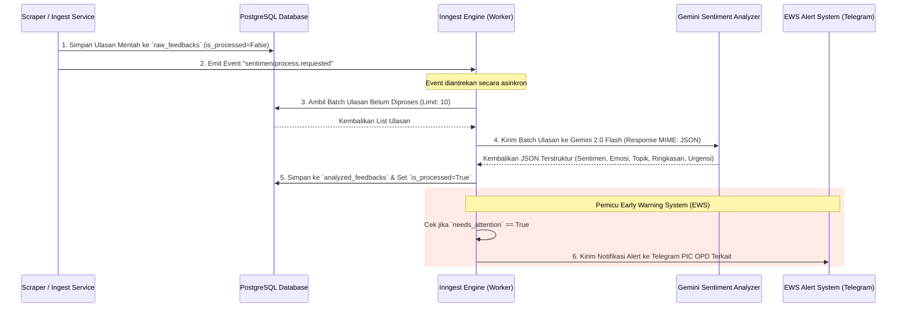
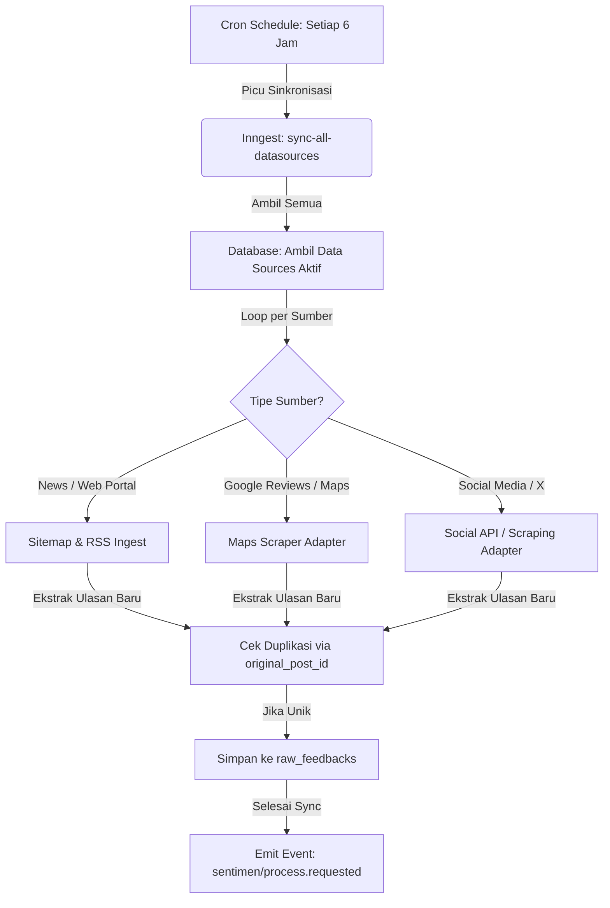
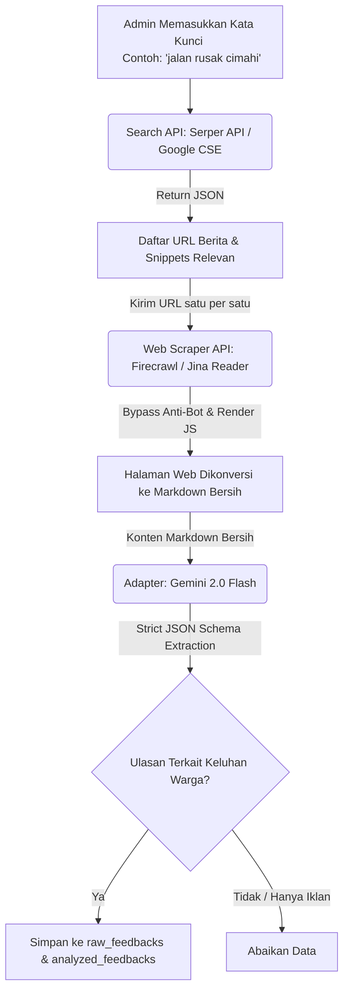

# Analisis Teknis dan Arsitektur Fitur Command Center

Dokumen ini menyajikan analisis teknis mendalam dan rekomendasi arsitektur untuk pengembangan tiga fitur utama sistem Command Center Sentimen Warga Kota Cimahi:
1. **Generate Sentimen (Sentiment Generation Flow)**
2. **Data Source (Registrasi Tautan & Sinkronisasi Otomatis)**
3. **Scraper & Web Search (Evaluasi Google AI vs Library Eksternal)**

---

## 1. Fitur Generate Sentimen (Sentiment Generation Flow)

Sistem saat ini telah memiliki fondasi analisis sentimen yang sangat baik menggunakan **Adapter Pattern** dan diorkestrasi secara asinkron menggunakan **Inngest**. Berikut adalah analisis alur kerja saat ini beserta rekomendasi optimasinya.

### 1.1 Arsitektur Alur Kerja Saat Ini

Analisis sentimen berjalan secara asinkron di latar belakang (*background processing*) dengan alur sebagai berikut:



### 1.2 Detail Komponen Sentimen saat Ini
*   **Provider**: `GeminiSentimentAnalyzer` menerapkan `BaseSentimentAnalyzer` menggunakan SDK resmi Google (`google-generativeai`).
*   **Model**: `gemini-2.0-flash` yang memiliki kecepatan sangat tinggi, jendela konteks besar, serta biaya API yang sangat murah.
*   **Temperatur**: `0.1` (sangat rendah untuk memastikan jawaban konsisten dan tidak berhalusinasi).
*   **JSON Schema**: Dikunci menggunakan `response_mime_type="application/json"` untuk memastikan *output* selalu berupa JSON valid dengan struktur:
    *   `sentiment` (`POSITIVE` / `NEGATIVE` / `NEUTRAL`)
    *   `emotion` (`Marah`, `Panik`, `Sedih`, `Apresiasi`, `Harapan`, atau `null`)
    *   `topics` (`list[str]` kata kunci spesifik)
    *   `summary` (`str` ringkasan maks 2 kalimat)
    *   `needs_attention` (`bool` bendera urgensi kebencanaan/ancaman keselamatan)

### 1.3 Rekomendasi Optimasi Fitur Sentimen

> [!TIP]
> **Optimasi Prompt dengan Dialek Lokal**: Warga Cimahi sering kali menyampaikan keluhan menggunakan bahasa Sunda, singkatan (*slang*), atau singkatan dinas setempat. Kami merekomendasikan penambahan kamus dialek lokal pada instruksi sistem (*System Instruction*) Gemini untuk meningkatkan akurasi.

1.  **Peningkatan Prompt Sentimen**:
    Memperbarui `SYSTEM_PROMPT` di `gemini_analyzer.py` agar secara spesifik memahami istilah lokal Cimahi (seperti nama wilayah: *Cibeureum, Baros, Leuwigajah*) dan bahasa Sunda gaul (seperti *runtah* untuk sampah, *leber* untuk banjir/luap, *meledak* untuk kondisi darurat).
2.  **Early Warning System (EWS) Integrasi Telegram**:
    Memanfaatkan kolom `needs_attention: true` untuk memicu notifikasi instan. Jika Gemini mendeteksi urgensi tinggi, buat fungsi Inngest tambahan `trigger-ews-alert` yang mengirim pesan ke Telegram bot grup koordinasi OPD terkait berdasarkan pemetaan `pic_contact` di tabel `target_entities`.
3.  **Dynamic Batch Processing**:
    Saat ini batch diatur statis sebanyak 10 ulasan sekali jalan. Jika volume data meningkat tajam (misal saat banjir kota), batch size dapat ditingkatkan dinamis hingga 30 ulasan dengan memanfaatkan *array input* terstruktur dalam satu *payload* untuk meminimalkan *round-trip* API key Gemini.

---

## 2. Fitur Data Source (Registrasi Tautan & Sinkronisasi Otomatis)

Fitur ini memungkinkan pengguna mendaftarkan tautan eksternal (sumber berita, halaman keluhan, RSS feed, sitemap) dan sistem secara berkala akan menyinkronkan data baru ke database Command Center.

### 2.1 Desain Database (Skema Saat Ini)
Tabel `data_sources` sudah dirancang dengan baik di database:
*   `id`: Primary Key.
*   `name`: Nama Data Source (misal: "Portal Berita Cimahi - Detik").
*   `source_id`: FK ke `sources` (menandakan apakah ini bertipe berita, sosial media, atau ulasan).
*   `url`: Alamat URL target sinkronisasi.
*   `target_entity_id`: FK ke `target_entities` (OPD/Fasilitas yang dipantau, misal: "Dinas Perhubungan").
*   `status`: Status keaktifan (`active`, `error`, `inactive`).
*   `last_scraped_at`: Timestamp kapan terakhir kali disinkronkan.

### 2.2 Arsitektur Sinkronisasi Otomatis (Auto Sync)

Untuk mewujudkan **"sekali pasang tautan, otomatis sync secara periodik"**, kita akan menggunakan fitur **TriggerCron** dan **Step Workflow** dari Inngest.



### 2.3 Rancangan Kode Implementasi Sinkronisasi Otomatis

Berikut adalah contoh rancangan fungsi Inngest yang akan dipasang di `backend/app/inngest_fns/data_source_functions.py` untuk menangani sinkronisasi otomatis:

```python
import inngest
from app.inngest_fns.client import inngest_client
from app.core.database import async_session_factory
from app.services.data_source_service import data_source_service
from app.services.scraper_service import scraper_service
from app.core.models import DataSource
from sqlalchemy import select

# 1. Cron Job Inngest untuk Pemicu Periodik (Misal: Tiap Jam 02.00 Malam)
@inngest_client.create_function(
    fn_id="scheduled-datasource-sync",
    trigger=inngest.TriggerCron(cron="0 2 * * *"),
    retries=1,
)
async def scheduled_datasource_sync(ctx: inngest.Context, step: inngest.Step):
    async def fetch_active_sources():
        async with async_session_factory() as db:
            result = await db.execute(
                select(DataSource).where(DataSource.status == "active")
            )
            return [{"id": ds.id, "url": ds.url, "name": ds.name} for ds in result.scalars().all()]

    active_sources = await step.run("fetch-active-datasources", fetch_active_sources)

    # Kirim event asinkron untuk masing-masing data source agar dieksekusi paralel
    events = [
        inngest.Event(
            name="datasource/sync.requested",
            data={"datasource_id": ds["id"], "url": ds["url"]}
        )
        for ds in active_sources
    ]
    
    if events:
        await step.send_event("trigger-individual-syncs", events)
        
    return {"triggered_count": len(events)}

# 2. Worker Eksekutor Sinkronisasi Individual
@inngest_client.create_function(
    fn_id="execute-datasource-sync",
    trigger=inngest.TriggerEvent(event="datasource/sync.requested"),
    retries=3,
)
async def execute_datasource_sync(ctx: inngest.Context, step: inngest.Step):
    ds_id = ctx.event.data["datasource_id"]
    url = ctx.event.data["url"]
    
    async def run_sync_extraction():
        async with async_session_factory() as db:
            # Panggil scraper service untuk mengunduh konten terbaru
            # Memperbarui last_scraped_at, mengunduh HTML, dan mengonversinya menjadi raw feedback
            result = await data_source_service.execute_sync_flow(db, ds_id)
            return result

    sync_result = await step.run("extract-and-ingest", run_sync_extraction)
    
    # Picu analisis sentimen untuk data mentah baru yang baru saja masuk
    await step.send_event(
        "trigger-sentiment-analysis",
        inngest.Event(name="sentimen/process.requested", data={})
    )
    
    return {"status": "success", "result": sync_result}
```

### 2.4 Alur Penggunaan pada Dashboard Frontend:
1.  **Form Input Sederhana**: Pengguna memasukkan judul data source, kategori (misal: Portal Berita), target OPD yang dipantau (misal: Dinas Lingkungan Hidup), serta tautan URL target.
2.  **Tombol "Sinkronkan Sekarang" (*Manual Trigger*)**:
    Selain otomatis tiap malam, pengguna bisa menekan tombol manual sync pada tabel DataSource. Tombol ini menembak endpoint `/api/v1/data-sources/{id}/scrape` yang akan memanggil fungsi sinkronisasi instan di atas, sehingga ulasan langsung tersinkron dalam waktu < 10 detik.

---

## 3. Fitur Scraper & Web Search (Evaluasi Google AI vs Library)

Warga sering kali membahas isu di berbagai portal berita atau forum web yang tidak memiliki RSS feed terstruktur. Sistem membutuhkan **Search & Scrape Engine** untuk mencari keluhan masyarakat menggunakan kata kunci (*keywords*) lalu menarik isi kontennya secara utuh.

Di bawah ini adalah evaluasi mendalam apakah kita perlu menggunakan **Google AI (Gemini Grounding / Search Tool)** atau **Library/API Khusus** untuk melakukan pencarian dan scraping.

### 3.1 Pilihan Pendekatan Teknologi

Kami membandingkan tiga skenario implementasi terbaik untuk modul Web Search & Scraper ini:

| Dimensi Evaluasi | Opsi A: Google AI (Gemini Search Grounding) | Opsi B: Programmatic Scraper Libraries (BeautifulSoup + Playwright + DDG HTML) | Opsi C: Hybrid (Search API + Web Scraper API + Gemini Extraction) <br>**(DIREKOMENDASIKAN)** |
| :--- | :--- | :--- | :--- |
| **Deskripsi Teknis** | Memanfaatkan fitur bawaan Gemini SDK (`google_search` tool) untuk meminta model mencari di Google secara langsung dan merangkum hasilnya. | Melakukan *search querying* via parsing HTML DuckDuckGo/Google secara manual, mengambil URL hasil pencarian, lalu membukanya menggunakan browser *headless* (Playwright). | Menggunakan API pencarian profesional (**Serper API** / **Google CSE**) untuk mengambil daftar URL, kemudian menggunakan Web Scraper API (**Firecrawl** / **Jina Reader**) untuk mengubah halaman web menjadi markdown bersih, lalu diekstrak datanya oleh Gemini. |
| **Kemudahan Implementasi** | **Sangat Mudah**: Cukup aktifkan opsi tools di SDK Gemini. Tanpa perlu coding web scraper terpisah. | **Rumit**: Harus menulis kode penanganan browser *headless*, mengatasi *anti-bot*, CAPTCHA, dan *layouting* HTML yang berubah-ubah. | **Sedang**: Integrasi HTTP client dengan dua API eksternal yang sangat andal dan terdokumentasi dengan baik. |
| **Ketahanan (*Resilience*)** | **Tinggi**: Google yang melakukan pencarian dan perayapan halaman. Sistem kita tidak akan pernah terkena blokir IP (*IP ban*) atau CAPTCHA. | **Sangat Rendah**: DuckDuckGo, portal berita lokal, dan media sosial memiliki proteksi anti-scraping yang ketat. IP server Anda akan diblokir dalam hitungan menit tanpa proxy berbayar. | **Sangat Tinggi**: Layanan seperti Firecrawl menangani rotasi proxy, bypass Cloudflare, CAPTCHA, dan rendering JavaScript secara otomatis. |
| **Kontrol Data Mentah** | **Rendah**: Gemini hanya mengembalikan hasil sintesis dan rangkuman beserta kutipan tautan. Kita tidak mendapatkan teks utuh halaman web asli untuk disimpan di DB `raw_feedbacks`. | **Tinggi**: Memiliki kendali penuh atas HTML mentah dan seluruh data teks yang diperoleh dari situs web. | **Sangat Tinggi**: Mendapatkan teks halaman web yang sudah dikonversi menjadi Markdown bersih bebas noise iklan/navigasi sebelum diumpankan ke DB dan Gemini. |
| **Biaya (*Cost*)** | **Sedang-Tinggi**: Biaya per token Gemini sedikit lebih tinggi ketika mengaktifkan search grounding. | **Gratis (Lokal)**: Hanya biaya resource server untuk menjalankan Playwright (sangat boros CPU/RAM). | **Sangat Murah**: <br>- Serper API gratis 2.500 pencarian awal ($1 per 1.000 pencarian berikutnya).<br>- Firecrawl gratis 500 scrape/bulan (bisa di-*self-host* secara gratis menggunakan Docker). |
| **Dukungan JavaScript (SPA)** | **Ya**: Google mengindeks halaman dinamis berbasis JavaScript. | **Ya (dengan Playwright)**: Namun membutuhkan beban server yang sangat tinggi. | **Ya**: Firecrawl dan Jina Reader secara bawaan merender JavaScript sebelum menyajikan teks. |

---

### 3.2 Mengapa Opsi C (Hybrid Approach) Adalah Solusi Terbaik?

> [!IMPORTANT]
> Menggunakan **Gemini Search Grounding saja (Opsi A) kurang cocok** untuk kebutuhan Command Center Sentimen Pemerintah.
> Hal ini karena Command Center mewajibkan penyimpanan data ulasan mentah (*Raw Feedback*) secara granular di database (untuk keperluan audit, pelacakan histori, statistik grafik, dan identifikasi penulis laporan). Gemini Search Grounding tidak mengekspos konten teks penuh dari tiap halaman yang dia cari, melainkan hanya menyajikan kesimpulan rangkumannya saja.
> 
> Di sisi lain, **Opsi B (Playwright lokal) terlalu rapuh** dan menghabiskan banyak sumber daya server, serta rentan terkena blokir IP.

Oleh karena itu, **Opsi C (Hybrid)** adalah arsitektur paling stabil, modern, dan andal untuk sistem berskala produksi (*Production-ready*).

---

### 3.3 Alur Arsitektur Rekomendasi (Opsi C)

Berikut adalah visualisasi alur data Opsi C (Hybrid Approach) mulai dari pencarian kata kunci hingga penyimpanan data sentimen:



### 3.4 Contoh Kode Implementasi Integrasi Hybrid Scraper

Berikut adalah contoh implementasi layanan pencarian dan ekstraksi berbasis Opsi Hybrid yang sangat kokoh untuk dipasang di `backend/app/services/search_service.py`:

```python
import httpx
import json
from app.core.config import get_settings
from app.providers.gemini_analyzer import GeminiSentimentAnalyzer

settings = get_settings()

class EnhancedSearchScraperService:
    """Service pencarian industri menggunakan Serper API + Jina Reader + Gemini."""

    def __init__(self):
        self.serper_api_key = settings.SERPER_API_KEY  # Disimpan di settings/env
        self.analyzer = GeminiSentimentAnalyzer()

    async def discover_and_ingest(self, query: str, limit: int = 5) -> dict:
        """
        Langkah 1: Cari URL menggunakan Serper API
        Langkah 2: Ambil konten halaman dengan Jina Reader (bisa juga Firecrawl)
        Langkah 3: Analisis & Ingest menggunakan Gemini
        """
        # --- LANGKAH 1: Cari URL via Serper API ---
        serper_url = "https://google.serper.dev/search"
        headers = {
            "X-API-KEY": self.serper_api_key,
            "Content-Type": "application/json"
        }
        payload = json.dumps({
            "q": f"{query} Cimahi",  # Batasi konteks daerah Cimahi
            "num": limit
        })

        async with httpx.AsyncClient(timeout=10.0) as client:
            response = await client.post(serper_url, headers=headers, data=payload)
            if response.status_code != 200:
                return {"error": "Gagal melakukan pencarian via Serper API"}
            
            search_results = response.json().get("organic", [])

        ingested_pages = []
        
        # --- LANGKAH 2 & 3: Iterasi URL, Ambil Teks, dan Analisis ---
        for item in search_results:
            target_url = item.get("link")
            title = item.get("title")
            
            # Gunakan Jina Reader untuk mengambil markdown bersih
            # Format: https://r.jina.ai/<URL>
            jina_reader_url = f"https://r.jina.ai/{target_url}"
            jina_headers = {
                "Accept": "text/markdown",
                # "Authorization": f"Bearer {settings.JINA_API_KEY}" # Opsional jika gratis habis
            }
            
            try:
                async with httpx.AsyncClient(timeout=15.0) as client:
                    scrape_resp = await client.get(jina_reader_url, headers=jina_headers)
                    if scrape_resp.status_code != 200:
                        continue
                    clean_markdown = scrape_resp.text
                
                # Gunakan Gemini untuk ekstraksi JSON terstruktur
                # Menggunakan method ekstraksi yang sudah ada di scraper_service
                extracted_data = await self.analyzer.analyze(
                    text=clean_markdown[:8000]  # Potong konteks agar hemat token
                )
                
                ingested_pages.append({
                    "url": target_url,
                    "title": title,
                    "analysis": extracted_data
                })
                
                # TODO: Simpan ulasan mentah & hasil analisis ke DB PostgreSQL
                
            except Exception as e:
                print(f"Gagal memproses URL {target_url}: {e}")
                continue

        return {
            "query": query,
            "total_processed": len(ingested_pages),
            "results": ingested_pages
        }
```

---

## 4. Kesimpulan Rekomendasi Langkah Aksi

1.  **Generate Sentimen**: Tetap gunakan **Gemini 2.0 Flash** dengan **Inngest Background Workers** (arsitektur saat ini sudah sangat bagus). Rekomendasi tambahan adalah penambahan dialek bahasa Sunda pada prompt dan mengaktifkan EWS notifikasi Telegram.
2.  **Data Source**: Buat fungsi sinkronisasi otomatis menggunakan **Inngest Cron Trigger** (berjalan tiap malam secara asinkron). Dan buat tombol manual sync di frontend yang memicu endpoint scraping secara instan.
3.  **Web Search & Scraper**: **Gunakan Opsi C (Hybrid: Serper API + Jina Reader/Firecrawl + Gemini)**. Ini adalah standar terbaik industri untuk mendapatkan data komparatif yang stabil, cepat, tanpa risiko diblokir anti-bot, dengan biaya operasional yang sangat rendah.

---
*Laporan Analisis selesai disusun. Siap untuk didiskusikan guna masuk ke tahap implementasi kode.*
