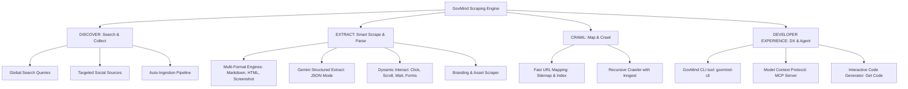

# Rencana Pengembangan Fitur Scraping & Crawling (GovMind Engine v2)
*Terinspirasi oleh Firecrawl UI/UX, Developer Experience (DX), & Arsitektur LLM-Ready Data Extraction*

Dokumen ini menganalisis fungsionalitas tingkat lanjut dari **Firecrawl** berdasarkan aset visual di folder [firecrawl/](file:///c:/Users/ASUS/Desktop/python-next-boilerplate/firecrawl), kemudian memetakan seluruh fitur premium tersebut ke dalam ekosistem **GovMind Cimahi** untuk menciptakan engine pengumpulan data publik paling tangguh.

---

## 📸 Ringkasan Fitur Lanjutan Firecrawl

Berdasarkan analisis visual mendalam pada aset:
1.  **Interact (NEW)**: Memungkinkan interaksi dinamis pada browser sebelum ekstraksi (mengisi form, klik tombol, menunggu elemen, eksekusi kode JS).
2.  **Map (NEW)**: Pemetaan URL instan (sitemap & index routing) tanpa perlu melakukan *crawling* penuh, mengembalikan daftar relasi link dalam hitungan detik.
3.  **Parse (NEW)**: Mesin parser modular yang bisa memecah dokumen mentah menjadi komponen granular.
4.  **Structured JSON Mode**: Ekstraksi AI dengan skema data kustom untuk mengembalikan output JSON valid sesuai skema data developer.
5.  **Multi-Format Selectors**: Mendukung output teks (*Markdown*, *Summary*), visual (*Screenshot*), struktural (*JSON*, *HTML*, *Links*, *Images*), dan metadata (*Branding*).
6.  **Agent & Dev Ecosystem (MCP & CLI)**: Model Context Protocol (MCP) untuk integrasi dengan AI Agent, antarmuka command-line (CLI), dan fitur **"Get Code"** multi-bahasa (Python, JS, cURL) untuk kemudahan integrasi developer.

---

## 🎯 Peta Arsitektur GovMind Engine (Firecrawl Mode)



---

## 🛠️ Rincian Modul & Fitur Premium

### 1. DISCOVER: Multi-Source Search & Auto-Ingest
Fitur pencarian web dinamis untuk menemukan keluhan warga dari berbagai platform eksternal.
*   **Search Engine Integration**: Pencarian Google, Google News, dan Bing API untuk mengumpulkan berita lokal Kota Cimahi.
*   **Multi-Platform Target**: Sumber spesifik seperti *Facebook Public Posts*, *Twitter/X search*, *Tiktok Comments*, dan *Community Forums* (Kaskus, DetikForum, dll).
*   **Get Code Generator**: Tombol **"Get Code"** yang langsung menampilkan kode integrasi untuk memicu penelusuran via API menggunakan Python, TypeScript, atau cURL.

---

### 2. EXTRACT: Smart Scraper & Dynamic Actions (Interact)
Modul ekstraksi premium untuk mengatasi halaman web modern (Single Page Applications, Infinite Scroll, Pop-up Cookies, Login Gates).

```
   ┌─────────────────────────────────────────────────────────────┐
   │                  EXTRACT / SCRAPE WORKFLOW                  │
   └──────────────────────────────┬──────────────────────────────┘
                                  │
                                  ▼
                     [ 1. Browser Initialization ]
                     (Playwright Headless Instance)
                                  │
                                  ▼
                       [ 2. Interact Actions ]
                 (Click buttons, Scroll down, wait)
                                  │
                                  ▼
                 [ 3. Capture Visual & Source Data ]
              (Generate HTML, Markdown, & Screenshot)
                                  │
                                  ▼
                [ 4. AI Parsing & JSON Extraction ]
             (Gemini Structured Output with JSON Schema)
```

*   **Browser Interact (Actions)**:
    *   *Click*: Mensimulasikan klik pada tombol dynamic seperti "Muat Lebih Banyak Komentar" atau dialog persetujuan cookies.
    *   *Scroll*: Scroll otomatis halaman secara tak terbatas (*Infinite Scroll*) untuk memuat konten dinamis.
    *   *Wait*: Menunggu elemen DOM spesifik termuat untuk mencegah konten kosong.
    *   *Form Input*: Memasukkan teks pada kolom pencarian internal website target sebelum data ditarik.
*   **Multi-Format Selectors**:
    *   `Markdown`: Konversi HTML ke Markdown bersih tanpa iklan, sidebar, header, dan footer.
    *   `Summary`: AI merangkum konten halaman target menjadi 1-2 paragraf singkat secara instan.
    *   `Question Mode`: Mengajukan pertanyaan spesifik pada AI mengenai halaman tersebut (misal: *"Siapa nama PIC yang bertanggung jawab atas layanan ini?"*).
    *   `JSON (Structured Extraction)`: Developer mendefinisikan skema data yang diinginkan menggunakan format JSON Schema, dan AI akan mengembalikan objek data yang presisi.
    *   `Screenshot Mode`: Mengambil snapshot visual dari seluruh halaman (*full-page screenshot*) sebagai arsip pengaduan warga.
    *   `Branding Scraper`: Mengekstrak logo, palet warna dasar, dan font yang digunakan di situs web tersebut.
    *   `Links & Images Extractor`: Menarik daftar semua URL eksternal dan link gambar beserta teks deskripsinya (*alt text*).

---

### 3. CRAWL: Mapper & Crawling Engine dengan Inngest
Pemetaan situs super cepat dan sistem antrean perayapan tangguh yang didesain menggunakan **Inngest**.

*   **Fast Mapping (Map Component)**:
    *   Mendapatkan daftar seluruh link aktif di domain web OPD Cimahi tanpa perlu merayap halaman satu per satu.
    *   Membaca dan mem-parsing file `sitemap.xml` secara otomatis jika tersedia untuk mempercepat pembentukan struktur navigasi.
*   **Recursive Crawling**:
    *   Perayapan halaman demi halaman secara rekursif dengan filter kedalaman tautan (*depth limit*) dan filter path (misal: hanya rayap URL yang mengandung kata `/pengaduan/`).
*   **Inngest Orchestration**:
    *   **Workflow Idempotency**: Setiap halaman yang sedang dirayap dicatat di database. Jika terjadi kegagalan sistem, Inngest akan menggunakan `step.run()` untuk melanjutkan antrean yang terhenti.
    *   **Rate-Limiting & Politeness Mode**: Mengatur jeda perayapan secara dinamis (*delay interval*) agar server pemerintahan Kota Cimahi tidak terbebani atau menganggap engine kita sebagai serangan DDoS.

---

### 4. DEVELOPER EXPERIENCE (DX) & AGENT INTEGRATIONS
Menjadikan GovMind platform yang ramah bagi pengembang sistem lain di internal pemerintahan Cimahi maupun untuk AI Agent eksternal.

*   **Model Context Protocol (MCP) Server**:
    *   Menyediakan endpoint MCP sehingga asisten AI modern (seperti Claude, Gemini, dll) bisa berinteraksi secara native dengan GovMind Scraping Engine.
    *   AI Agent dapat memanggil fungsi `search_cimahi_issues`, `scrape_page`, atau `map_opd_sitemap` langsung dari interface chat mereka.
*   **GovMind CLI (`govmind-cli`)**:
    *   Tool baris perintah berbasis Node.js/Python untuk developer internal.
    *   Command: `govmind-cli scrape https://cimahi.go.id --format markdown --screenshot`
*   **Get Code Module**:
    *   UI interaktif yang menampilkan contoh snippet kode instan di dashboard untuk mempermudah integrasi program luar:
        *   **cURL**: Perintah HTTP murni.
        *   **Python (SDK)**: Menggunakan pustaka request bawaan.
        *   **Node.js / Next.js**: Menggunakan fetch modern.

---

## 📈 Tampilan Antarmuka Dasbor Baru (Next.js Frontend)

Dasbor `/dashboard/scraper` akan dirancang dengan standard visual premium menggunakan **Glassmorphism**, warna gradien, dan grafik interaktif:

1.  **Main Interactive Scraper Card**:
    *   Kolom URL input yang dilengkapi dengan tombol parameter filter kustom.
    *   Tab pemilih format ekstraksi yang interaktif (visual grid berisi tombol Markdown, JSON Schema, Screenshot, dll).
2.  **Live Action Log / Console Output**:
    *   Console log interaktif yang menampilkan proses ekstraksi real-time (misal: `[Playwright] Launching browser...`, `[Interact] Scrolling page...`, `[Gemini AI] Extracting structured data...`).
3.  **Visual Screenshot Gallery**:
    *   Preview visual screenshot yang berhasil diambil dari web dinas.
4.  **Concurrent Browsers Monitor**:
    *   Widget sirkuler yang menunjukkan jumlah browser headless yang aktif dari pool server backend.
5.  **MCP Server Status Widget**:
    *   Menampilkan status konektivitas eksternal Model Context Protocol.

---

## 📋 Langkah Eksekusi Berbasis Inngest & Playwright

### Fase 1: Playwright Core & Multi-Format Parser (Backend FastAPI)
*   [ ] Menginstal dan mengonfigurasi **Playwright** di server backend.
*   [ ] Membuat modul extractor serbaguna (`markdown_parser`, `screenshot_generator`, `asset_extractor`).
*   [ ] Mengintegrasikan modul **Structured Data Extraction** menggunakan Gemini API Key dinamis dari `system_settings`.

### Fase 2: Inngest Workflows & Sitemap Mapping
*   [ ] Mengonfigurasi Event Triggers di Inngest (`scraping/url.requested`, `crawling/site.requested`).
*   [ ] Membuat step-step pendelegasian crawling menggunakan `step.run()` di `backend/app/inngest_fns/crawling_functions.py`.
*   [ ] Membuat utilitas **Sitemap Mapper** cepat untuk ekstraksi struktur tautan.

### Fase 3: Dashboard Web Dev Studio & MCP (Frontend Next.js)
*   [ ] Mendesain UI `/dashboard/scraper` dengan antarmuka tab (Search, Scrape, Crawl).
*   [ ] Mengintegrasikan fitur **"Get Code"** snippet generator.
*   [ ] Menyediakan endpoint `/api/mcp` sebagai jembatan protokol AI Agent eksternal.
